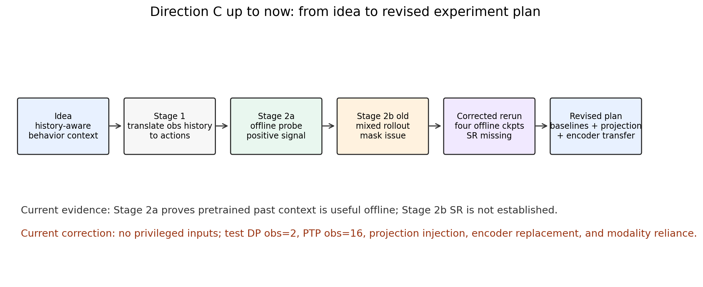
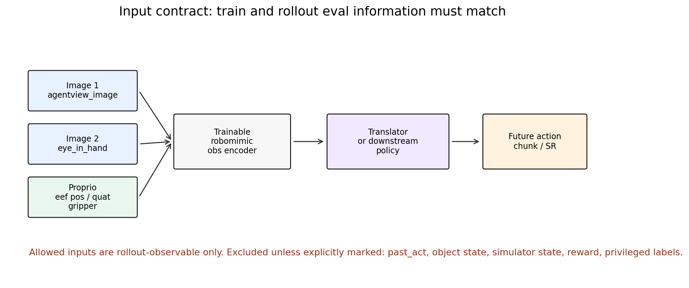
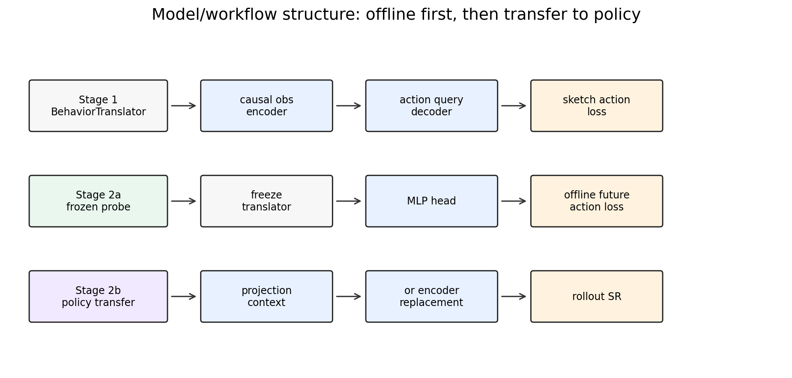
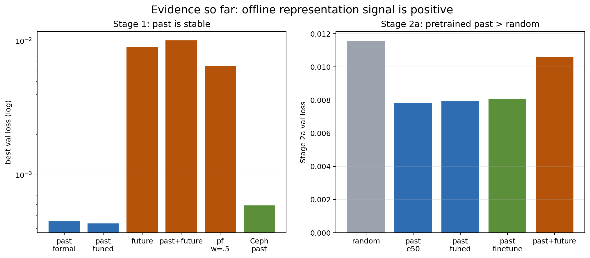
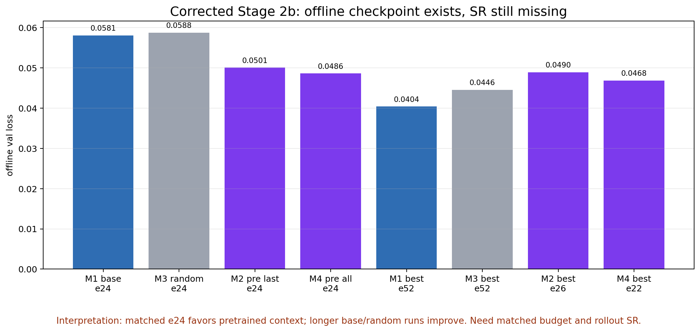
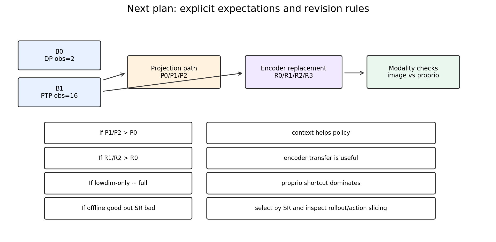

# Behavior Translator 方向完整探索汇报

Feishu document: https://feishu.cn/docx/WJSDdG6LBoxrjTx3zY6cmGVknDc

Owner: intern_ldp_explorer｜Project: ldp｜Date: 2026-05-27

## 摘要

这份文档从最初 idea 开始，整理 Direction C Behavior Translator 到目前为止的全部探索、结果、修正和下一步实验计划。

当前最保守的结论是：translator 预训练确实在 offline probe 里学到了比同结构 random translator 更有用的 behavior context；但这个 context 是否能稳定提升 DP/PTP 的 rollout success rate，还没有被 corrected rollout 证明。

当前最重要的下一步是：修好 Ceph rollout runtime，在相同 rollout protocol 下先跑 M1/M2/M3/M4 的 e24 SR；拿到更多 GPU 后启动 B0/B1 baseline，再跑 projection path 和 encoder replacement path。

## 1. 原始 idea

最开始的问题不是“translator 能否直接当 policy”，而是一个更小的 representation 问题。

- 假设：obs history 到 action 的翻译任务，会迫使模型学到历史观测和行为趋势之间的对齐。
- 目标：translator 预测的 action 可以很粗糙，但它的 hidden state 可能能作为 downstream DP/PTP 更好的 condition。
- 核心判据：pretrained translator context 要优于 same-architecture random translator context。
- 如果这个判据成立，说明收益不是单纯来自更多参数或多了一个模块。

第一版刻意不做 action tokenizer、VQ-VAE、latent diffusion、EMA teacher、future obs prediction 和复杂 contrastive loss。原因是我们要先验证最小闭环是否有信号。

## 2. 输入契约

我们现在明确要求 train 和 rollout eval 的信息一致。当前合法输入只有 eval 时能拿到的 observation。

- image1：`agentview_image`，第三方/front RGB camera，shape `[3,84,84]`。
- image2：`robot0_eye_in_hand_image`，wrist / eye-in-hand RGB camera，shape `[3,84,84]`。
- proprio：`robot0_eef_pos`，末端位置，shape `[3]`。
- proprio：`robot0_eef_quat`，末端四元数，shape `[4]`。
- proprio：`robot0_gripper_qpos`，夹爪关节位置，shape `[2]`。

当前 Direction C translator 使用 `image_abs.hdf5`，不包含 `past_act`。past action 和 future action 只是训练 label，不作为输入。

需要排除的 privileged 信息包括：`past_act`、object state、simulator state、reward、task success label。除非后面明确标记为 privileged ablation，否则这些不进入主实验。

## 3. 数据窗口

当前主设置是 Square/mh。

- H=16：obs history。
- P=16：past action supervision。
- K=8：future action supervision / downstream action chunk。
- anchor 规则：obs 使用 `o[t-15:t]`，past action 使用 `a[t-16:t-1]`，future action 使用 `a[t:t+7]`。
- Square/mh 大约 300 demos、80,731 frames。
- 训练切分使用 episode-level split，val_ratio=0.02，约 79,289 train windows 和 1,442 val windows。

这个设置保证了 translator 输入是 history observation，目标是历史或未来 action，而不是把 action history 偷偷喂给模型。

## 4. 当前模型结构

Stage 1 是 BehaviorTranslator。

- raw image/proprio 进入 robomimic obs encoder。
- obs tokens 进入 causal observation encoder。
- learnable action queries 通过 decoder 读 obs hidden。
- sketch action head 预测 past / future / past+future action。
- decoder hidden 和 last obs hidden 汇总成 behavior context。

Stage 2a 是 frozen-head probe。

- freeze translator。
- 只训练一个 MLP future-action head。
- 用它测试 pretrained context 是否比 random context 更有用。

Stage 2b 是 downstream policy transfer。

- 当前已经实现 projection path：translator context 经过 projector，注入到 policy condition tokens。
- 计划新增 encoder replacement path：把 translator 训练出的 obs encoder 直接替换或初始化 downstream policy encoder。

## 5. Stage 1 探索

我们尝试了三个 Stage 1 目标。

- `past`：obs history -> past action。
- `future`：obs history -> future action。
- `past_future`：obs history -> past + future action。

原始直觉上，`past_future` 最接近“理解历史并预测未来”。但结果显示，`future` 部分更不稳定，验证 loss 很早 early-best，然后 train loss 继续下降但 validation 反弹。更可能的原因是未来动作本身多模态，同一段视觉/本体历史对应多种合理后续动作。

关键结果如下。

- historical `past` formal：best `0.000455 @ e113`。
- historical `past` tuned：best `0.000434 @ e118`，这是历史最好结果。
- historical `future`：best `0.008961 @ e4`，early-best 后验证变差。
- historical `past_future` equal weight：best `0.010111 @ e4`。
- historical `past_future` with `w_future=0.5`：best `0.006501 @ e4`，有改善但仍弱于 `past`。
- current Ceph `past`, obs lr `1e-4`：best `0.0005926 @ e31`。
- current Ceph `past`, obs lr `5e-5`：best `0.0005978 @ e31`。

阶段判断：`past` 不是最漂亮的语义目标，但目前最稳定，适合作为主 representation pretraining。`future` 和 `past_future` 暂时作为 ablation 保留。

## 6. Stage 2a 探索

Stage 2a 是 offline probe，不产生 rollout success rate。

它回答的问题是：freeze translator 后，context 是否比 random context 更容易预测 future action？

结果是正向的。

- frozen random translator：val loss `0.011571`，future L1 `0.06736`。
- pretrained `past` e50 frozen：val loss `0.007839`，future L1 `0.04917`。
- tuned `past` frozen：val loss 约 `0.007959`。
- tuned `past` finetune：val loss 约 `0.008056`。
- pretrained `past_future` frozen：val loss 约 `0.0106-0.0136`，弱于 `past`。

这个结果说明 pretrained `past` context 确实不是 random。它学到了 offline future-action probe 可用的信息。

## 7. 旧 Stage 2b 探索和问题定位

旧 Stage 2b 把 translator context 接入 transformer DP/PTP 后，rollout 结果是混合的。

- add_all e24：pretrained `0/10`，random `2/10`。
- add_all e49：pretrained `2/10`，random `5/10`。
- add_all e99：pretrained `4/10`，random `3/10`。
- add_last e49：pretrained `4/10`，random `0/10`。

这些旧结果现在只能作为 diagnostic，不能作为最终证据。

原因是后来发现 action8 设置下有 condition visibility 问题。旧设置里 `horizon=8`、`n_obs_steps=16`、`causal_attn=true`、`n_cond_layers=0`，action token 实际上看不到 condition token 8..15。因此最新 obs 和 `add_last` context 可能不可见。

修正方式是：corrected Stage 2b 设置 `policy.causal_cond_attn=false`，让 action token 可以 attend 到全部已知 obs history/context。

## 8. Corrected Stage 2b 当前进展

当前 Ceph-only corrected Stage 2b 四组已经都有 checkpoint。注意，这里仍然是 offline validation loss，不是 SR。

M1：base no-context。

- e24 val loss：`0.058112`。
- 当前 best：`0.040411 @ e52`。
- 最新日志约 epoch 54。

M3：random translator add_last。

- e24 val loss：`0.058755`。
- 当前 best：`0.044589 @ e52`。
- 最新日志约 epoch 54。

M2：pretrained `past` add_last。

- e24 val loss：`0.050084`。
- 当前 best：`0.048950 @ e26`。
- 最新日志约 epoch 27。

M4：pretrained `past` add_all。

- e24 val loss：`0.048616`。
- 当前 best：`0.046840 @ e22`。
- 最新日志约 epoch 27。

当前观察有两层。

- 在 matched e24 附近，M2/M4 pretrained context 的 offline loss 明显低于 M1/M3，这是积极信号。
- 但是 M1/M3 训练更久后继续下降，M1 e52 已经低于 M2/M4 当前 best，所以不能用不同训练长度直接判断胜负。

当前最缺的是 SR。训练配置没有自动 rollout，且 Ceph py39 rollout runtime 仍缺 `robosuite`，`mujoco_py` OSMesa 编译缺 `GL/osmesa.h`。

## 9. 当前分析

第一，Stage 1 的 `past` 信号最好，但它可能部分来自 proprio shortcut。

因为 recent EEF pose / gripper state 很容易解释 recent action，translator 有可能主要学 proprio 到 past action 的映射，而不是充分使用 image。当前代码确实输入了 image，但 loss 本身不能证明 image 被使用。

第二，Stage 2a 是目前最干净的正证据。

pretrained `past` context 明显优于 random context，这说明 hidden state 至少包含了 future-action probe 有用的信息。

第三，Stage 2b 仍在验证中。

matched e24 offline loss 对 pretrained context 有利，但 SR 未跑出，且不同训练长度下 base 也能继续变好。因此现在不能 claim downstream success rate 提升。

第四，注入方式需要扩展。

当前 projection path 把 context 压成一个 pooled vector，再加到 condition token 上。这可能太弱，也可能语义不对。encoder replacement 可以测试：收益到底来自 pooled context，还是来自 translator 训练过的 obs encoder。

## 10. 新的实验设计

Baseline 先分成两个。

- B0：default DP base。obs=2，`cond[0..1]`。目的：建立短历史 DP 的 SR 标尺。
- B1：proven PTP base。obs=16，`cond[0..15]`，训练目标包含 past+future action。目的：建立强 long-context baseline。

Projection path 用来测试当前 context 注入。

- P0：B1 + random translator context projection。预期：不应稳定优于 B1。
- P1：B1 + pretrained context add_last。预期：若 translator context 有效，应优于 P0。
- P2：B1 + pretrained context add_all。预期：如果 context 需要全局影响，P2 可能优于 P1；如果过度干扰时序 token，P2 会不稳定。

Encoder replacement path 用来测试 encoder transfer。

- R0：B1 + random same-architecture encoder。预期：作为 replacement control，不应稳定优于 B1。
- R1：B1 + frozen translator obs encoder。预期：如果 encoder 表征有用，应优于 R0。
- R2：B1 + finetuned translator obs encoder。预期：可能优于 R1，但有破坏预训练表征的风险。
- R3：B0 + finetuned translator obs encoder。预期：测试 translator encoder 是否也能帮助 default DP。

## 11. 如果结果不符合预期，如何修正

- 如果 P1/P2 不优于 P0：说明 pretrained context 没被用上，或 context 本身无效。修正方向是做 modality check、改 token context、检查 projector 训练。
- 如果 P2 优于 P1：说明 broadcast context 更容易被 transformer 利用。修正方向是保留 add_all，但重点检查 rollout stability。
- 如果 P1 优于 P2：说明 context 更适合作为 latest belief。修正方向是主线用 add_last 或 extra context token。
- 如果 R1/R2 优于 projection path：说明主要收益可能来自 obs encoder pretraining。修正方向是把主线转到 encoder replacement。
- 如果 lowdim-only 接近 full：说明当前 translator 可能主要依赖 proprio shortcut。修正方向是加 image-only、proprio-drop training，或设计视觉 grounding 更强的目标。
- 如果 offline val 好但 SR 差：说明 offline diffusion loss 与 rollout 表现不一致。修正方向是 SR-first checkpoint selection、更多 seeds、检查 action slicing 和 normalizer。

## 12. Todo

- 修 Ceph rollout runtime：补 `robosuite`，补 `mujoco_py` OSMesa header/runtime。
- 对 M1/M2/M3/M4 e24 先跑统一 reward-only SR smoke。
- 在新 GPU 上启动 B0 和 B1 baseline。
- 实现并启动 P0/P1/P2 projection path。
- 实现并启动 R0/R1/R2/R3 encoder replacement path。
- 补 modality 诊断：image-masked eval、proprio-masked eval、lowdim-only retrain、image-only retrain。

## 13. 路径

- 本地报告目录：`/work-agents/intern_ldp_explorer/ldp/docs/direction_c_behavior_translator/feishu_translator_full_report_2026-05-27`
- Ceph active root：`/mnt/cephfs/home/tinwen.du/intern_ldp_explorer/direction_c_behavior_translator`
- 当前代码分支：`intern_ldp_explorer/task002_flow_matching_square_toolhang`
