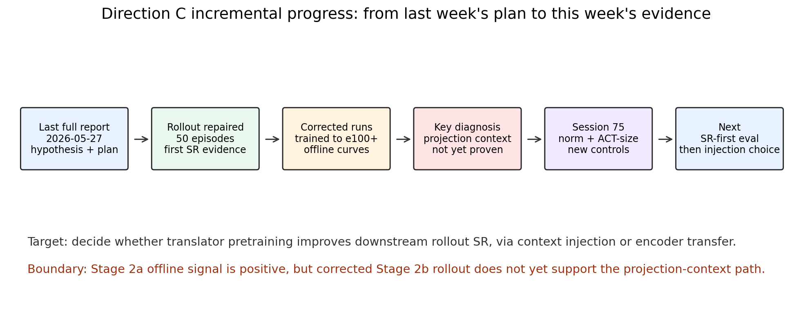
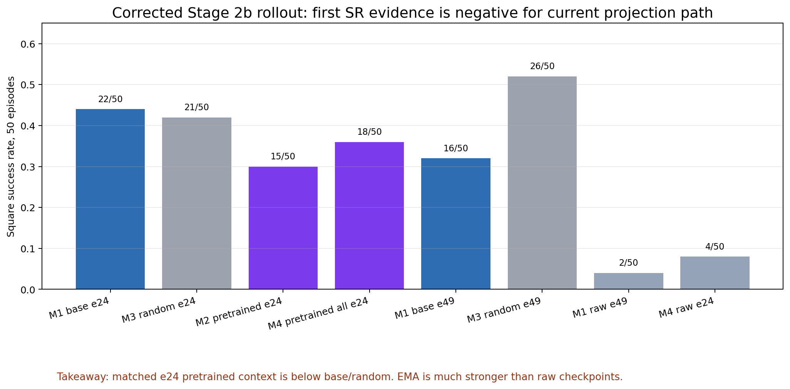
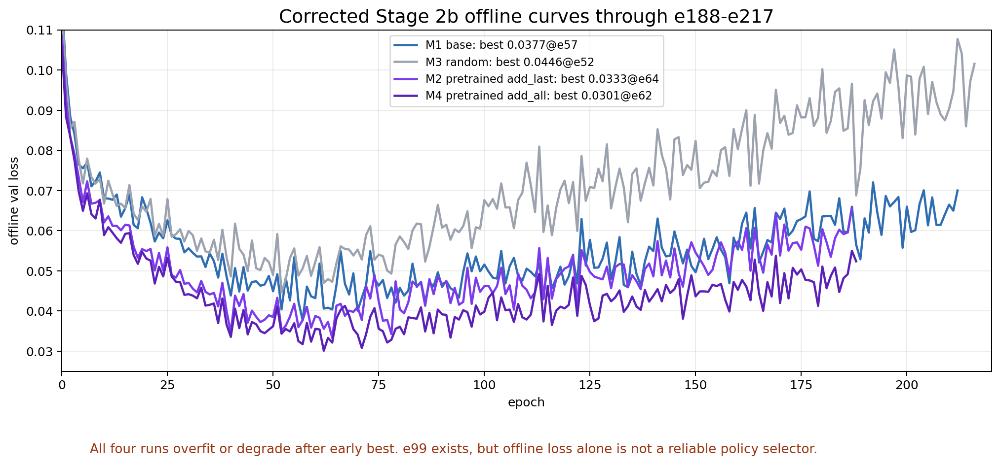
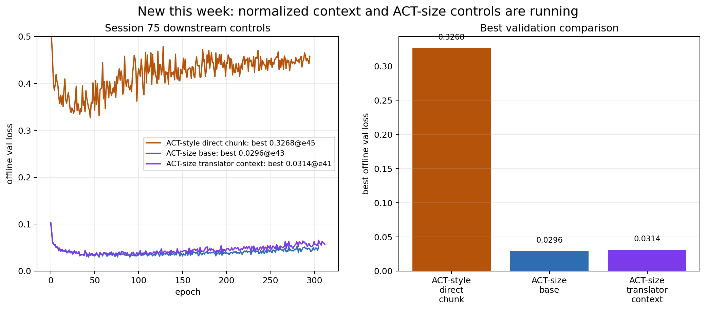
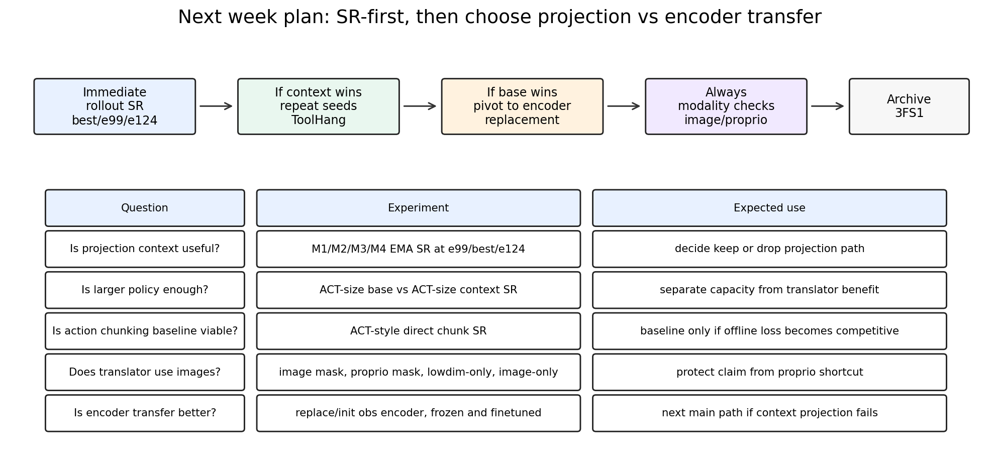

# Direction C Behavior Translator 增量进展汇报

Owner: intern_ldp_explorer｜Project: ldp｜Date: 2026-06-01｜Scope: 上周到这周增量

## 摘要

这份文档不是完整重写，而是承接 2026-05-27 的完整汇报，说明从上周计划到这周新增证据之间发生了什么。

最终目标仍然是验证一个小而关键的问题：history-to-action translator 预训练得到的 hidden state，是否能让下游 DP/PTP 的 rollout success rate 更好。translator 本身不是最终 policy；我们要判断它作为 context 或 encoder pretraining 是否有用。

当前新增结论是三点。

- 第一，corrected Stage 2b 的 50-episode rollout 已跑通，但当前 pooled projection 注入路径没有赢过 base/random control。
- 第二，offline validation loss 和 rollout SR 的排序不一致，所以后面必须以 SR 为主，而不是只看 validation loss。
- 第三，本周已经启动了更大 ACT-size 容量和 context normalization 控制实验；其中 ACT-size diffusion base/context 的 offline loss 更低，ACT-style direct chunking 明显更差，三者都还没有对应 rollout SR。

## 1. 上周计划是什么

上周完整报告的计划可以压缩成四件事。

- 修正 Stage 2b condition visibility 后，跑 M1/M2/M3/M4 的统一 rollout SR。
- 建立更清楚的 baseline：一个是默认 DP 的短历史 obs=2，另一个是 PTP 风格长历史 obs=16。
- 分开验证两条注入路线：projection path 和 encoder replacement path。
- 补 modality 诊断，确认 translator 是否真的使用 image，而不是只靠 proprio 推 past action。

这四件事的优先级里，rollout SR 是第一位。原因是 Stage 2a 已经证明 offline representation 有信号，但下游是否 work 只能靠 rollout。

## 2. 本周做了什么

本周主要推进了四块。

- 重新打通 py39 + robomimic 0.2.0 的 Square reward-only rollout runtime，并完成 50-episode eval。
- 把 corrected Stage 2b 四组训练推进到 e100 以后，并检查 e99、best-val、后续 epoch 的 validation 趋势。
- 复查数据流，确认 Stage1 `target_mode=past` 只优化 past action loss；`get_context()` 里的 pooled context projector 没有直接 Stage1 loss，这是一个关键风险点。
- 新增 Session 75 控制实验：Stage1 action loss scaling、translator context LayerNorm、ACT-size DP/PTP baseline、ACT-style deterministic chunking baseline。

当前仍然缺的是这些新 checkpoint 的 rollout SR，尤其是 corrected e99/best-val 和 Session 75 act-size 结果。

## 3. 新增 rollout 结果

本周最关键的新结果是 corrected Stage 2b 的 50-episode Square rollout。

结果如下。

- M1 base e24，EMA：22/50，SR 44%。
- M3 random context e24，EMA：21/50，SR 42%。
- M2 pretrained context add_last e24，EMA：15/50，SR 30%。
- M4 pretrained context add_all e24，EMA：18/50，SR 36%。
- M1 base e49，EMA：16/50，SR 32%。
- M3 random context e49，EMA：26/50，SR 52%。
- M1 base e49 raw model：2/50，SR 4%。
- M4 pretrained add_all e24 raw model：4/50，SR 8%。

直接解读是：在当前 pooled projection injection 设计里，已跑的 e24 EMA 对照显示 pretrained translator hidden 经由 underconstrained pooled context projector 后没有通过 go/no-go。它在 e24 没有优于 same-architecture random context，也没有优于 base；best-val/e99/e124 的 SR 仍待补测。

这里还有两个附带结论。

- 在已检查的两个 raw-model control 上，EMA 明显比 raw checkpoint 强，后续 rollout 默认应该用 EMA。
- random context 表现不差，说明“多一个模块、额外 token、投影层或正则化效应”本身可能已经影响 policy，必须保留 random control。

## 4. corrected Stage 2b 的训练曲线

corrected Stage 2b 四组都有 e99 checkpoint，并且训练继续到了更后面。

当前 offline best 是：

- M1 base：best val loss 0.037692 at e57，latest observed 0.070021 at e212。
- M3 random context：best 0.044589 at e52，latest observed 0.101548 at e216。
- M2 pretrained add_last：best 0.033300 at e64，latest observed 0.065726 at e187。
- M4 pretrained add_all：best 0.030108 at e62，latest observed 0.052371 at e188。

这个曲线有两个信息。

- 从 offline loss 看，pretrained add_last/add_all 的 best loss 比 base/random 更低。
- 但已有 e24/e49 rollout 结果没有同步支持这个排序，best-val/e99 的 SR 仍待补，所以 offline loss 不能作为最终排序依据。

我的判断是：现有 projection path 可能让 diffusion loss 变好，但没有稳定转化为 rollout 行为质量。下一步必须补 e57/e62/e64 best-val 和 e99/e124 的 SR，确认这是 early checkpoint 偶然性，还是 projection path 本身无效。

## 5. Session 75 新控制实验

本周新增了一组更偏工程控制的实验，目的是回答两个问题。

- 当前失败是不是因为模型容量太小或 context 数值尺度不稳？
- 一个直接 action chunking baseline 是否能作为非 diffusion 的参照？

已实现并启动的内容包括：

- Stage1 translator 支持 `action_loss_reduction=sum_action_dim` 和 `loss_scale`，避免 action 维度被过度平均后梯度过小。
- Downstream policy 支持 `translator_context_norm=true`，在 frozen context 后加 trainable LayerNorm/projector。
- 新增 ACT-style deterministic action chunking v0；它是 ACT-size transformer chunking baseline，不是完整 CVAE ACT。
- 新增 ACT-size DP/PTP base 和 ACT-size normalized translator-context 配置。

截至 2026-06-01 02:46 UTC，本组 offline 状态是：

- ACT-size base：best val loss 0.029648 at e43，e99 为 0.035269，latest observed 0.047268 at e303。
- ACT-size translator context：best 0.031377 at e41，e99 为 0.036745，latest observed 0.060885 at e310。
- ACT-style direct chunking：best 0.326795 at e45，latest observed 0.448215 at e293，明显不如 diffusion-style loss。
- Stage1 normalized past translator：best raw val loss 0.003488 at e172，latest 0.004762 at e258；这里的 `val/loss_total` 是 unscaled raw logged loss，但 reduction 已从 mean 改为 `sum_action_dim`，所以不能和旧 Stage1 mean-loss 直接比较。

阶段判断是：ACT-size diffusion base 比旧 base 更低，ACT-size normalized context 比旧 add_last context 更低，但不强于旧 add_all best。当前 ACT-size base 仍略优于 ACT-size context。ACT-style direct chunking 的 offline loss 过高，除非 rollout 意外好，否则它更像容量参照，不像主线候选。

## 6. 当前分析

第一个判断：projection context 当前不成立为正结果。

它在 Stage 2a offline probe 里有正信号，但在 corrected Stage 2b 的早期 rollout 里没有赢。更严格地说，当前证据只否定“pretrained translator hidden + underconstrained pooled context projector + projection 注入方式”，还不能否定 translator pretraining 本身。

第二个判断：offline loss 和 SR 不一致。

M4 的 offline loss 可以比 base 好，但 rollout SR 更差。这意味着后面不能用 validation loss 单独宣称有效。报告和实验表都应该把 SR 放在第一列。

第三个判断：past objective 可能存在 proprio shortcut。

`past` 目标稳定，但也最容易由 EEF pose 和 gripper state 推断近期动作。当前输入确实包含两路 image 和 proprio，但 loss 不能证明 image 被使用。因此后面必须补 image-masked、proprio-masked、lowdim-only 和 image-only 检查。

第四个判断：context projector 没被 Stage1 直接约束。

Stage1 训练优化 sketch action head；而 Stage2b 使用的是 `get_context()` 产出的 pooled context。现在这个 context projector 不是由下游目标前的明确 auxiliary loss 直接约束的。这个风险会推动我们尝试 encoder replacement，或者让 downstream 使用 action-side tokens 而不是 pooled vector。

## 7. 下一步设计

下一步要按 SR-first 的方式推进。

优先级 1：补 rollout。

- corrected Stage2b：M1/M2/M3/M4 的 best-val、e99、e124 EMA SR。
- Session 75：ACT-size base、ACT-size context、ACT-style direct chunking 的 best/e99 EMA SR。
- 每组先 50 episodes；如果差异接近，再扩到 100 或更多 seeds。

优先级 2：完成 baseline 分层。

- B0：默认 DP base，obs=2，作为短历史 DP 标尺。
- B1：PTP 风格 base，obs=16，保留 past+future action 训练逻辑，作为强 long-context baseline。

优先级 3：根据 SR 决定路线。

- 如果 projection context 在 SR 上仍输给 base/random，就不要继续堆 projection path，转向 encoder replacement。
- 如果 context 在某些 checkpoint 赢，就复测更多 seeds 和 ToolHang，确认不是 seed noise。
- 如果 ACT-size base 已经强很多，后续所有 context 对照都要 matched capacity。

优先级 4：补 modality 诊断。

- 固定 ckpt 做 image mask / shuffle eval。
- 固定 ckpt 做 proprio mask / shuffle eval。
- 训练 lowdim-only translator。
- 训练 image-only translator。

## 8. 当前状态和路径

当前可访问 GPU 是 `10.100.0.20:26715`，8xH200。Session 75 四个进程仍在跑。

- GPU0：Stage1 normalized past translator。
- GPU1：ACT-style action8。
- GPU2：ACT-size base DP/PTP。
- GPU3：ACT-size normalized translator context。
- GPU4-GPU7 当前空闲。

主要路径如下。

- 代码分支：`intern_ldp_explorer/task002_flow_matching_square_toolhang`。
- 权威代码：`/work-agents/intern_ldp_explorer/ldp`。
- Ceph execution copy：`/mnt/cephfs/home/tinwen.du/intern_ldp_explorer/direction_c_behavior_translator/repos/ldp`。
- 当前输出根目录：`/mnt/cephfs/home/tinwen.du/intern_ldp_explorer/direction_c_behavior_translator/outputs`。
- 最新完整报告：`https://feishu.cn/docx/WJSDdG6LBoxrjTx3zY6cmGVknDc`。

## 9. 本周结论

本周最重要的进展不是“translator 已经提升 SR”，而是把边界变清楚了。

- Stage2a 的 offline frozen-head/probe 正信号仍然存在，但这不是 SR 证据。
- Stage2b 当前 projection path 没有在 SR 上过关。
- 大容量和归一化控制已经启动；ACT-size diffusion base/context 的 offline loss 更低，但 direct chunking baseline 仍明显偏弱。
- 后续主线应该是 SR-first，并准备把重点从 pooled context injection 转向 encoder transfer 或 action-side token context。

如果下周 rollout 仍显示 base 或 random context 更强，我建议正式降低 projection path 优先级，把 Direction C 主线改成“translator encoder pretraining / replacement 是否帮助 PTP-style long-context policy”。
