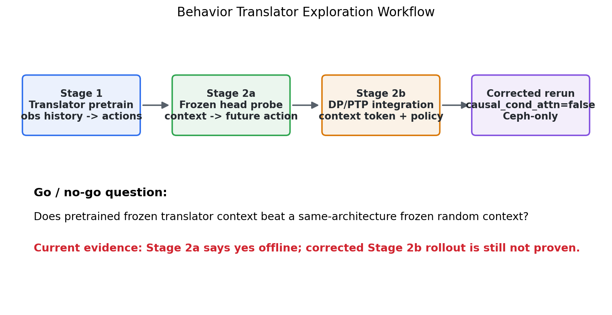
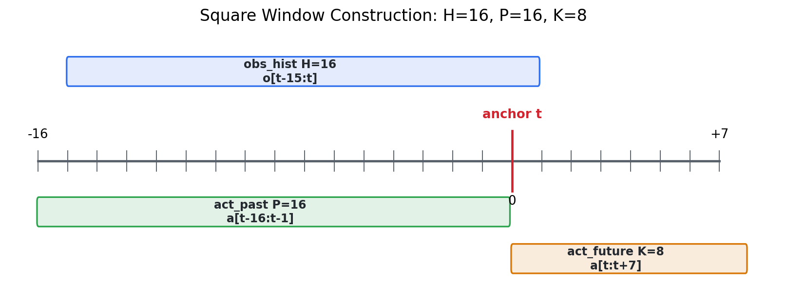
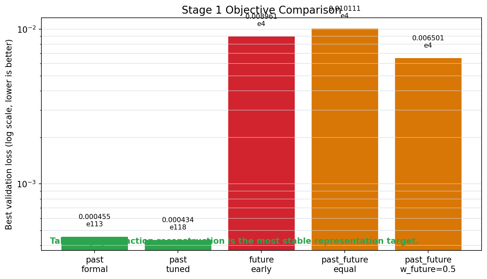
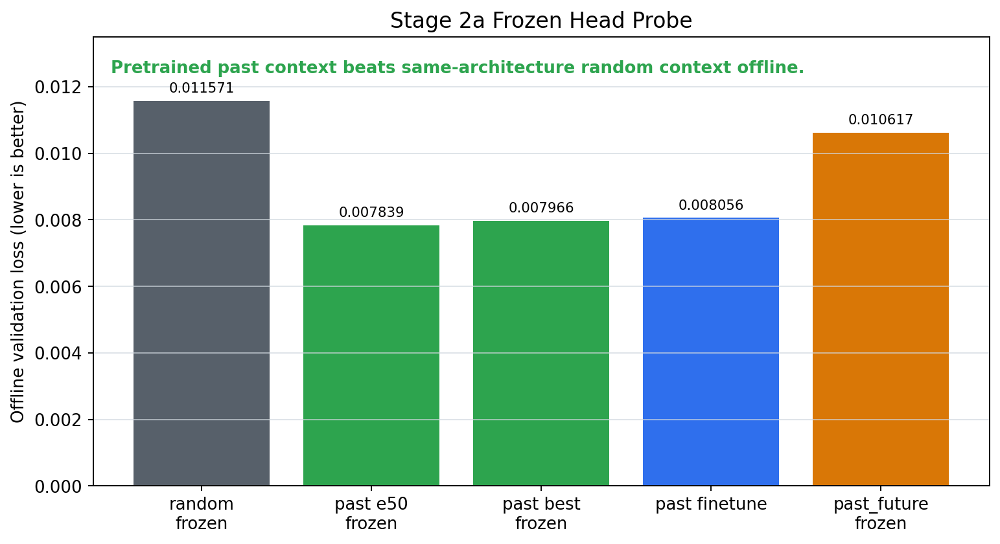
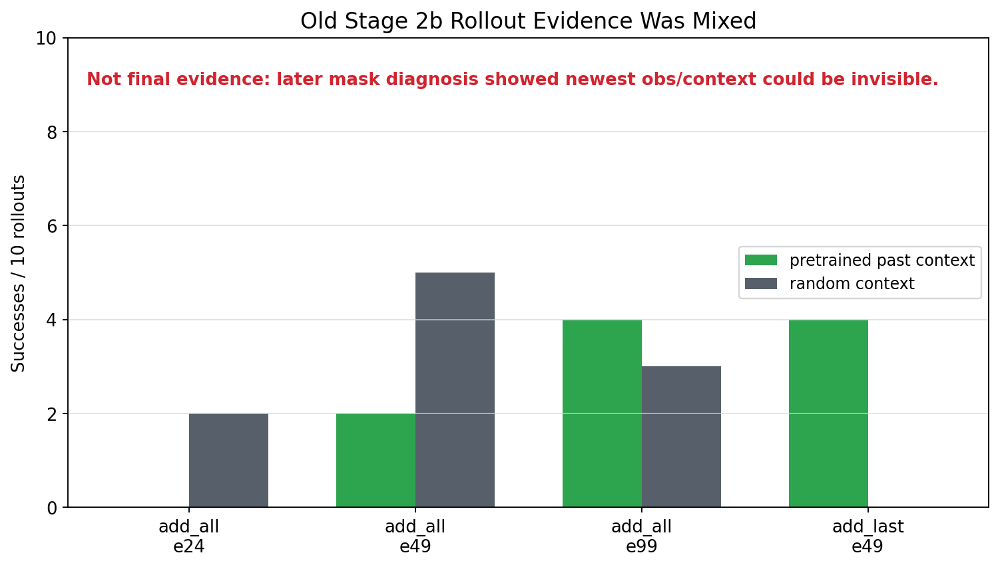
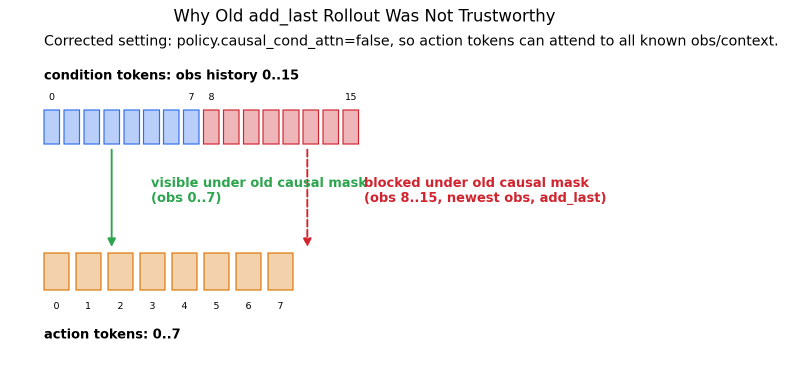
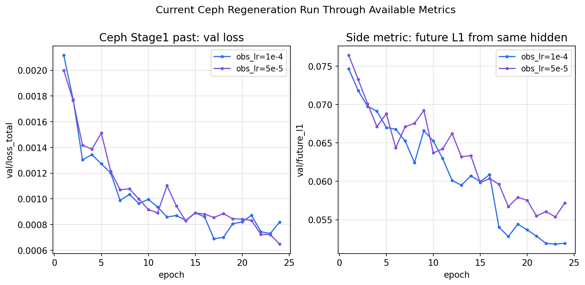

# Behavior Translator 方向探索汇报

Feishu document: https://feishu.cn/docx/GDsFdAw5yo5jVUxwW1ycgGNInme

# Behavior Translator 方向探索汇报

Owner: intern_ldp_explorer｜Project: ldp｜Date: 2026-05-26｜Scope: Direction C

一句话结论：用 observation history 预测 past action 的 translator，已经在 offline probe 中证明能学到比同结构 random translator 更有用的 behavior context；但 corrected DP/PTP rollout 成功率还没有形成稳定正证据。

当前判断：past 是最稳的 Stage 1 目标；future / past_future 更接近直觉，但验证 loss 容易早停和反弹；旧 Stage 2b rollout 只能作为诊断材料，因为后来发现 condition mask 会让最新 obs 与 add_last context 不可见。

图 1｜探索工作流：从 translator pretrain 到 frozen-head probe，再到 DP/PTP corrected rerun。

## 1. 原始问题与验证假设

最初目标不是让 translator 直接替代 policy，而是验证：history-to-action translator 学到的 hidden state 能否作为下游 DP/PTP 的 behavior-aware condition。

核心判据：PTP/DP + pretrained frozen translator context > PTP/DP + same-architecture frozen random context。这个判据用于排除“只是多了参数或多了 token”的解释。

第一版刻意不做 action tokenizer、VQ-VAE、latent diffusion、EMA teacher、future obs prediction 和复杂 contrastive loss；优先验证最小闭环。

## 2. 数据窗口与样本构造

主实验使用 Square/mh image_abs.hdf5，raw image/proprio 输入，robomimic obs_encoder 参与训练。当前窗口：H=16 obs history，P=16 past action，K=8 future action。

以 anchor t 为中心：obs_hist=o[t-15:t]，act_past=a[t-16:t-1]，act_future=a[t:t+7]。代码中 sequence_length=24，anchor=16，obs indices=1..16，past action indices=0..15，future action indices=16..23。

Square/mh split：300 demos，80,731 frames；val_ratio=0.02 选 6 个 validation demos；train windows=79,289，val windows=1,442。当前 padding 设置使每个 frame 对应一个 temporal window。

图 2｜当前 H/P/K 的窗口切片方式。

## 3. 实现范围

已实现模块：BehaviorTranslationDataset、BehaviorTranslator、Stage 1 trainer、Stage 2a frozen head probe、TranslatorConditionedTransformerHybridImagePolicy，以及 TransformerForDiffusion 的 causal_cond_attn 开关。

主模型流：raw obs history -> robomimic obs_encoder -> causal obs encoder -> action-query decoder -> sketch action head / behavior_context。Stage 2b 采用最小侵入方式：base policy condition tokens + projected translator context。

## 4. Stage 1：translator 预训练

对比过三类目标：past 预测历史 action，future 预测未来 action，past_future 同时预测历史和未来。

关键结果：past formal best=0.000455 @ e113；past tuned best=0.000434 @ e118；future early best=0.008961 @ e4；past_future equal-weight best=0.010111 @ e4；past_future w_future=0.5 best=0.006501 @ e4。

判断修正：原先直觉上 past_future 最合理，但实验显示 future 目标更受多模态动作影响，验证 loss 很早变差；past 虽然更像 reconstruction，却更稳定，更适合作为 representation pretraining 主线。

图 3｜Stage 1 objective 的 best validation loss 对比。

## 5. Stage 2a：frozen-head representation probe

Stage 2a 只做 offline future-action prediction，不产生环境成功率。它回答的问题是：freeze translator 后，behavior_context 是否比同结构 random context 更好用。

关键结果：random frozen val loss=0.011571 / future L1=0.06736；pretrained past e50 frozen val loss=0.007839 / future L1=0.04917；past best/latest frozen 约 0.00796-0.00803；past finetune 约 0.008056；past_future frozen 约 0.0106-0.0136。

结论：pretrained past context 明显优于 frozen random context，这是目前最干净的正证据，说明 translator hidden state 学到了 future-action probe 可用的信息。

图 4｜Stage 2a frozen-head probe：past context 明显优于 random。

## 6. Stage 2b：接入 DP/PTP 后的旧证据与诊断

旧 Stage 2b rollout 结果混合：add_all pretrained/random 在不同 checkpoint 上互有胜负；add_last e49 有一个 pretrained 4/10 vs random 0/10 的正点，但样本数小且后来被 mask 诊断削弱。

旧结果片段：add_all e24 pretrained 0/10 vs random 2/10；add_all e49 2/10 vs 5/10；add_all e99 4/10 vs 3/10；add_last e49 4/10 vs 0/10。

图 5｜旧 Stage 2b rollout 只能说明现象混合，不能作为最终结论。

关键诊断：action8 设置下 horizon=8、n_obs_steps=16、causal_attn=true、n_cond_layers=0，使 action token 只能 attend 到 obs condition token 0..7；obs 8..15、最新 obs 和 add_last context 对 action decoder 不可见。

因此 corrected run 必须设置 policy.causal_cond_attn=false，让 action token 可以 attend 到全部已知 obs history/context。

图 6｜mask 诊断：旧 add_last 正点不应被当作 translator 起效证明。

## 7. 当前 Ceph-only corrected rerun 状态

NFS/3FS 下线后，当前使用 Ceph-only root：/mnt/cephfs/home/tinwen.du/intern_ldp_explorer/direction_c_behavior_translator。py39 / robomimic==0.2.0 环境位于 envs/ptp_ldp_py39_ceph。

已完成/可用的 corrected checkpoint：M1 base no-context epoch24 val_loss=0.058112；M3 frozen random add_last epoch24 val_loss=0.058755。当前 offline loss 略偏向 base，但这不是 rollout 成功率。

为了补回 NFS 上不可用的 translator ckpt，已在 Ceph 重训 Stage1 past。到当前可用 metrics：obs_lr=1e-4 best 0.000689 @ e17；obs_lr=5e-5 best 0.000648 @ e24。历史 NFS tuned best 0.000434 仍更强。

M2 pretrained past add_last 与 M4 pretrained past add_all 已用 Ceph Stage1 best.ckpt 启动；目前还没有与 M1/M3 epoch24 可比的 checkpoint/rollout 表。

图 7｜Ceph 当前 Stage1 past 重训曲线，用于补回 pretrained context checkpoint。

## 8. 当前结论

结论 A：translator 作为直接 policy 不够精细，但 past-action reconstruction 的 hidden state 在 offline probe 中确实更有用。

结论 B：future/past_future 目标并非第一版主线。它们更贴近直觉，但当前设置下验证表现不稳；更适合作为后续 ablation，而不是现在的主结果。

结论 C：Stage 2b 成败还未定。必须等待 corrected causal_cond_attn=false 的 pretrained-vs-random-vs-base rollout 表，再判断是否能转化为环境成功率提升。

结论 D：当前主要系统瓶颈不是文件读取或 GPU 算满，而是 raw-image batch 构造、ColorJitter、numpy/torch copy 与 DataLoader IPC；/dev/shm=16G 限制了高 worker 设置。

## 9. 建议推进顺序

1. 先完成 corrected Stage2b 四组对比：M1 base no-context、M2 pretrained past add_last、M3 random add_last、M4 pretrained past add_all。

2. 对同一 checkpoint cadence 做 reward-only Robomimic rollout，至少先跑 n=10 快速筛，再对有信号的点扩到更多 seeds。

3. 若 pretrained context 仍不胜出，优先改注入方式：从 pooled context 改为 h_action token context，或只暴露 future/past-side tokens，避免一个 pooled 向量过度压缩。

4. 若 pretrained context 胜出，再扩展到 ToolHang，并补 kNN future-action consistency / hidden similarity correlation 作为表征分析。

## 10. 关键路径

本地长报告：/work-agents/intern_ldp_explorer/ldp/docs/direction_c_behavior_translator/translator_exploration_report_2026-05-26.md

本次图表资产：/work-agents/intern_ldp_explorer/ldp/docs/direction_c_behavior_translator/feishu_translator_report_2026-05-26/

Ceph active root：/mnt/cephfs/home/tinwen.du/intern_ldp_explorer/direction_c_behavior_translator
