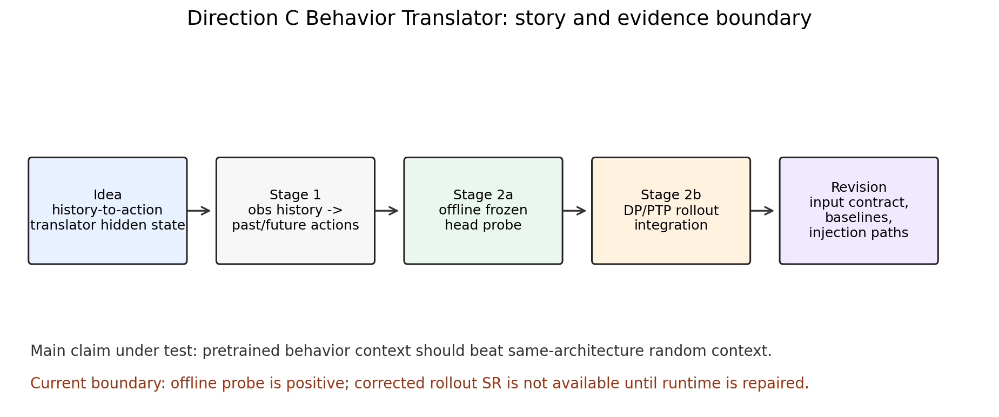
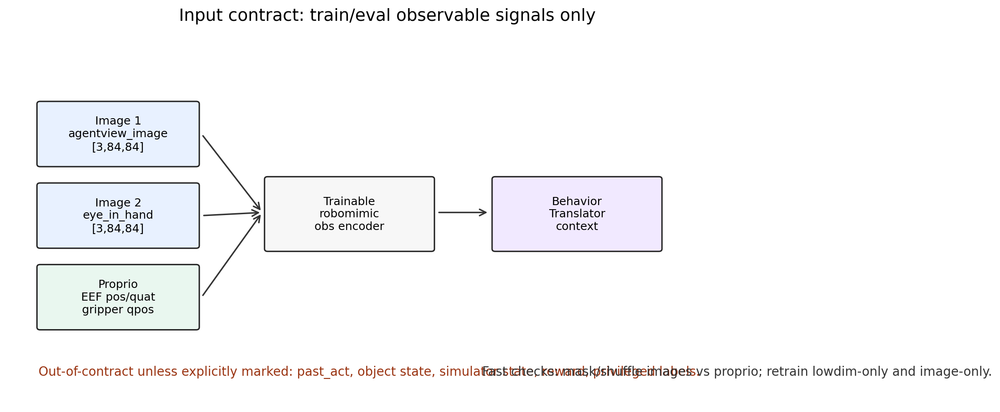
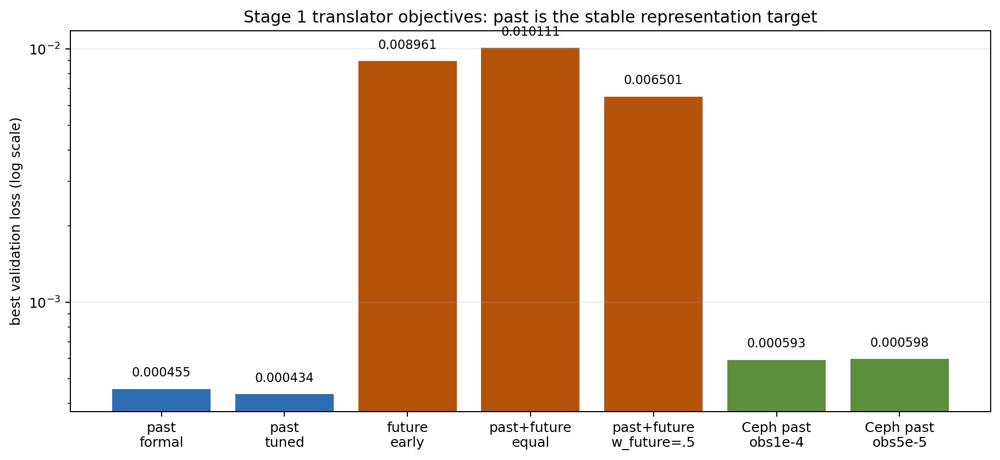
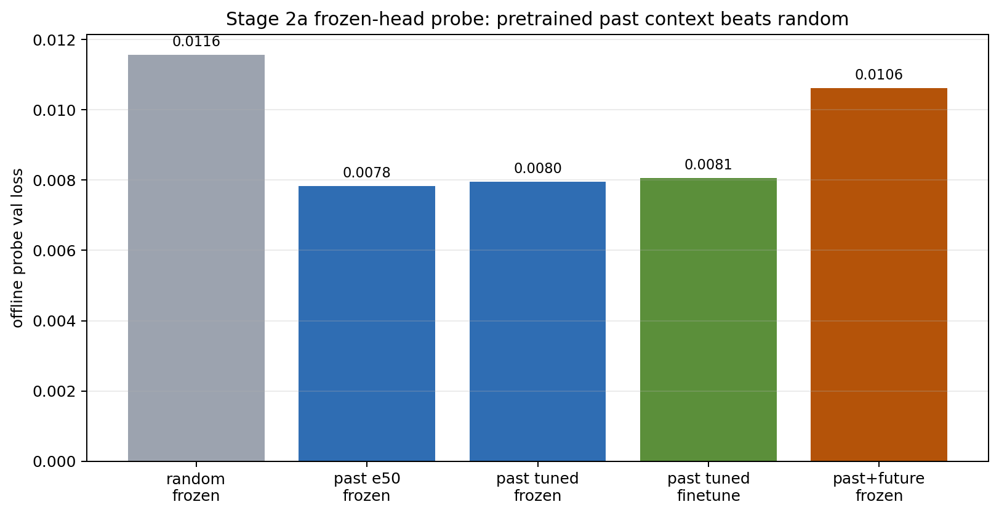
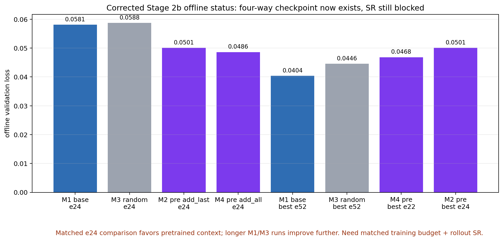
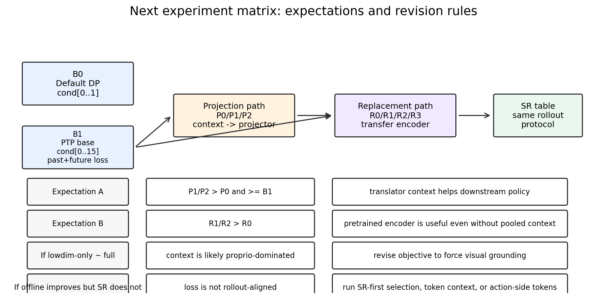

# Direction C Behavior Translator 更新汇报

Feishu document: https://feishu.cn/docx/OGUcdSos4o21a5x3prZcfe65nVh

Owner: intern_ldp_explorer｜Project: ldp｜Date: 2026-05-27｜Scope: Translator / Stage 2b revision

## 一句话结论

Direction C 的核心想法仍然成立为一个待验证假设：translator 通过 observation history 学到 behavior-aware hidden state，这个 hidden state 可能帮助下游 DP/PTP。但现在最严谨的边界是：Stage 2a offline probe 已经给出正信号；corrected Stage 2b 已有四组 offline checkpoint，成功率 SR 还没有跑出，因为 Ceph py39 rollout runtime 缺 `robosuite` 且 `mujoco_py` 缺 OSMesa header。

图 1 展示当前故事线：从 idea 到 Stage 1/2a/2b，再到本轮根据结果修正实验矩阵。



## 1. Idea 出发点

最初目标不是让 translator 直接当 policy，而是验证：

> obs history -> action translation 这个预训练任务是否能学到一种 behavior-aware context，让下游 DP/PTP 更容易生成未来动作 chunk。

核心判据原本是：

```text
PTP/DP + pretrained frozen translator context
    >
PTP/DP + same-architecture frozen random context
```

这个判据用于排除“只是多了模块或多了参数”的解释。

## 2. 输入契约：训练和 rollout eval 必须一致

我们刚重新明确了输入约束：rollout-facing policy 和 translator 只允许使用 eval 时也能拿到的 observation。

| 类别 | key | 含义 |
|---|---|---|
| image1 | `agentview_image` | 第三方/front RGB camera |
| image2 | `robot0_eye_in_hand_image` | wrist / eye-in-hand RGB camera |
| proprio | `robot0_eef_pos` | end-effector position |
| proprio | `robot0_eef_quat` | end-effector quaternion |
| proprio | `robot0_gripper_qpos` | gripper joint positions |

当前 Direction C translator configs 使用的是 `image_abs.hdf5`，不包含 `past_act`。past/future action 只作为训练监督 label，不作为输入。

图 2 说明当前输入路径和要补的 modality 验证。



### 2.1 为什么要补 modality 验证

虽然代码路径确实包含 image1/image2/proprio，但当前 loss 不能证明 translator 真正用了 image。`past` objective 表现最好，有可能主要学到 proprio 到近期 action 的映射。这个问题不影响当前代码正确性，但会影响我们如何解释方法贡献。

计划补四个检查：

| 检查 | 操作 | 预期 |
|---|---|---|
| image-masked eval | 固定 ckpt，eval 时置零或 shuffle 两路 image | 若 loss 不变，image 贡献小 |
| proprio-masked eval | 固定 ckpt，eval 时置零或 shuffle proprio | 若 loss 大幅变差，proprio 主导 |
| lowdim-only retrain | 只保留 proprio 训练 | 若接近 full，说明 image 不是必要条件 |
| image-only retrain | 只保留两路 image 训练 | 若明显更差，说明当前 objective 缺少视觉 grounding 压力 |

## 3. Stage 1：translator 预训练结果

实验从三个目标开始：`past`、`future`、`past_future`。原始直觉上 `past_future` 最接近“理解历史并预测未来”，但结果推动了我们修正判断。

| 目标 | best validation | 判断 |
|---|---:|---|
| historical `past` formal | `0.000455 @ e113` | 稳定 |
| historical `past` tuned | `0.000434 @ e118` | 当前历史最好 |
| historical `future` | `0.008961 @ e4` | early-best 后验证变差 |
| historical `past_future` equal weight | `0.010111 @ e4` | future 部分拖累 |
| historical `past_future`, `w_future=0.5` | `0.006501 @ e4` | 有改善但仍弱于 past |
| current Ceph `past`, obs lr `1e-4` | `0.000593 @ e31` | 可用但弱于历史 best |
| current Ceph `past`, obs lr `5e-5` | `0.000598 @ e31` | 与 `1e-4` 接近 |

图 3 给出 Stage 1 目标对比。



阶段判断：`past` 不是最“语义漂亮”的目标，但它是目前最稳定的 behavior-history representation pretraining。`future/past_future` 仍保留为 ablation，不作为当前主线。

## 4. Stage 2a：offline frozen-head probe

Stage 2a 不产生 SR，只回答一个更便宜的问题：

> freeze translator 后，context 是否比 same-architecture random context 更容易预测 future action？

结果是正向的。

| Context | val loss | future L1 | 解释 |
|---|---:|---:|---|
| frozen random translator | `0.011571` | `0.06736` | 控制组 |
| pretrained `past` e50 frozen | `0.007839` | `0.04917` | 明显更好 |
| tuned `past` frozen | `0.007959` | - | 与 e50 接近 |
| tuned `past` finetune | `0.008056` | - | 未明显优于 frozen |
| pretrained `past_future` frozen | `~0.0106-0.0136` | - | 当前弱于 `past` |

图 4 展示 offline probe 的主要证据。



分析：Stage 2a 支持“translator hidden state 不是 random”的说法，但它还不能证明环境成功率会提升。

## 5. 旧 Stage 2b rollout 为什么降级为诊断

旧 Stage 2b 曾有混合 rollout：

| Setting | Result |
|---|---|
| add_all e24 | pretrained `0/10`, random `2/10` |
| add_all e49 | pretrained `2/10`, random `5/10` |
| add_all e99 | pretrained `4/10`, random `3/10` |
| add_last e49 | pretrained `4/10`, random `0/10` |

这些结果不能作为最终 evidence。后来定位到 action8 设置下 `horizon=8, n_obs_steps=16, causal_attn=true, n_cond_layers=0` 会让 action token 看不到 condition token 8..15。也就是说最新 obs 和 `add_last` context 在旧设置里可能不可见。

修正：corrected runs 使用 `policy.causal_cond_attn=false`。

## 6. Corrected Stage 2b 当前状态

当前 Ceph-only corrected Stage 2b 四组都已经有 checkpoint。仍需强调：下面是 offline validation，不是 SR。

| ID | Setting | e24/e25 附近 | 当前 best | 状态 |
|---|---|---:|---:|---|
| M1 | base no-context | e24 `0.058112` | `0.040411 @ e52` | running |
| M3 | random add_last | e24 `0.058755` | `0.044589 @ e52` | running |
| M2 | pretrained `past` add_last | e24 `0.050084` | `0.050084 @ e24` | running |
| M4 | pretrained `past` add_all | e24 `0.048616` | `0.046840 @ e22` | running |

图 5 展示 corrected offline 状态。



当前分析：

- 在 matched e24 位置，M2/M4 pretrained context 的 offline loss 明显低于 M1/M3，这是一个积极信号。
- M1/M3 继续训练到 e52 后又显著下降，说明不能只拿不同训练长度比较。
- M4 `add_all` 在早期 offline loss 上强于 M2 `add_last`，说明 broadcast context 可能更容易被 transformer 利用；但它也更可能覆盖时序 obs token，需要 SR 验证。
- SR 仍缺失。原因是 Ceph py39 环境目前 `robomimic==0.2.0` 可用，但 `robosuite` 缺失，`mujoco_py` OSMesa 编译缺 `GL/osmesa.h`。

## 7. 我对当前结果的修正判断

| 原假设 | 现阶段观察 | 修正 |
|---|---|---|
| `past_future` 应该是主目标 | future 部分验证不稳 | 以 `past` 为主线，`past_future` 做加权 ablation |
| Stage 2a 正信号可以直接转成 SR | Stage 2b 受 mask 和注入方式影响 | SR 必须用 corrected matrix 单独验证 |
| pooled context 足够 | projection path 可能压缩过强 | 同时测试 encoder replacement 和 token-level context |
| translator 可能学视觉历史 | `past` 可能被 proprio shortcut 解释 | 补 modality mask / lowdim-only / image-only 验证 |

## 8. 结合新建议后的下一步实验设计

我们把 downstream 重新组织成两个 baseline、两条 translator transfer 路径。

### 8.1 Baseline

| ID | Setting | 目的 | 预期 |
|---|---|---|---|
| B0 | default DP, obs=2, `cond[0..1]` | 标准短历史 DP baseline | 给出最基础 SR 标尺 |
| B1 | proven PTP, obs=16, `cond[0..15]`, past+future objective | 强 long-context baseline | 应优于或接近 B0；若不优，先修 PTP baseline |

### 8.2 Projection path

| ID | Setting | 目的 | 预期 |
|---|---|---|---|
| P0 | B1 + random translator context projection | 架构控制 | 不应稳定优于 B1 |
| P1 | B1 + pretrained context `add_last` | 低风险 context 注入 | 若 hypothesis 成立，应优于 P0 |
| P2 | B1 + pretrained context `add_all` | 强 broadcast 注入 | 若 context 需要全局影响，可能优于 P1 |

### 8.3 Encoder replacement path

| ID | Setting | 目的 | 预期 |
|---|---|---|---|
| R0 | B1 + random same-architecture encoder | replacement control | 不应稳定优于 B1 |
| R1 | B1 + frozen translator obs encoder | 测 frozen encoder transfer | 若 encoder 表征有用，应优于 R0 |
| R2 | B1 + finetuned translator obs encoder | 测端到端适配 | 可能优于 R1，但有破坏预训练表征的风险 |
| R3 | B0 + finetuned translator obs encoder | 测是否帮助 default DP | 若只帮 PTP 不帮 DP，说明收益依赖 long-context objective |

图 6 展示矩阵和修正规则。



## 9. 结果不符合预期时的修正规则

| 现象 | 解释 | 修正 |
|---|---|---|
| P1/P2 不优于 P0 | pretrained context 没被用上，或 context 无效 | 做 modality check；改成 token context；检查 projector 训练 |
| P2 优于 P1 | broadcast context 更有效 | 保留 `add_all`，同时检查是否伤害 rollout stability |
| P1 优于 P2 | context 更适合作为最新 belief | 主线用 `add_last` 或额外 context token |
| R1/R2 优于 projection path | 主要收益来自 obs encoder pretraining | 主线转向 encoder replacement |
| lowdim-only 接近 full | 方法可能主要是 proprio shortcut | 加 image-only / proprio-drop training，或改目标为视觉 grounding 更强的任务 |
| offline val 好但 SR 差 | loss 与 rollout 不一致 | 用 SR-first checkpoint selection，补更多 seeds，检查 action slicing / normalizer |

## 10. Todo

1. 修 Ceph rollout runtime：安装/迁移 `robosuite`，补 `mujoco_py` OSMesa header/runtime。
2. 对 M1/M2/M3/M4 的 e24 checkpoint 先跑统一 reward-only SR smoke。
3. 在新卡上启动 B0/B1 baseline，作为后续所有 transfer 实验的 SR 标尺。
4. 实现 projection path 的 P0/P1/P2 完整矩阵。
5. 实现 encoder replacement path 的 R0/R1/R2/R3。
6. 补 modality 诊断：image-masked eval、proprio-masked eval、lowdim-only retrain、image-only retrain。

## 11. 路径

本地报告目录：`/work-agents/intern_ldp_explorer/ldp/docs/direction_c_behavior_translator/feishu_translator_report_2026-05-27`

Ceph active root：`/mnt/cephfs/home/tinwen.du/intern_ldp_explorer/direction_c_behavior_translator`

当前代码分支：`intern_ldp_explorer/task002_flow_matching_square_toolhang`
